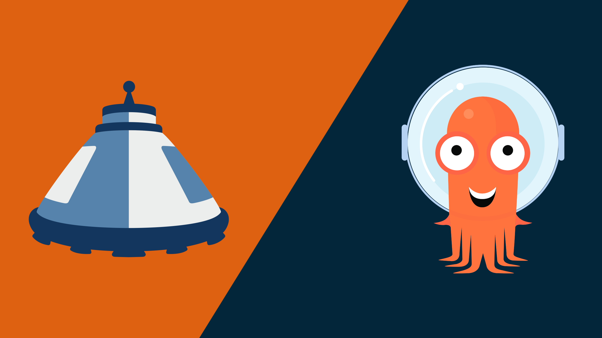
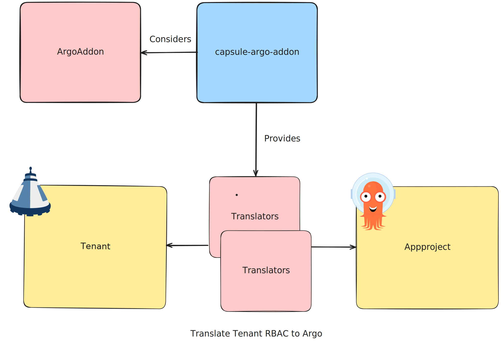

> This addon is currently in public beta and under active development. Please report any issues you encounter. Using it in production is not recommended as it may lead to unexpected behaviors.

# Capsule ❤️ Argo

This addon is designed for kubernetes administrators, to automatically translate their existing Capsule Tenants into Argo Appprojects. This addon adds new capabilities to the Capsule project, by allowing the administrator to create a new tenant in Capsule, and automatically create a new Argo Appproject for that tenant. This addon is designed to be used in conjunction with the Capsule project, and is not intended to be used as a standalone project.

We have chosen a very loose implementation which makes use of so called "Translators" to translate the Capsule Tenant into an Argo Appproject. This allows us to easily add new translators for different use cases and translate permissions from the Capsule Tenant into the Argo Appproject.

By design the Addon is designed to work with the capsule-proxy, but it also works without it. We have yet to discover the performance with the capsule-proxy in place vs without it. Each Tenant is translated into a dedicated Appproject. Each Appproject gets it's own declarative and project scoped cluster. Which is finally also a dedicated ServiceAccount, who is promoted as owner on the corresponding tenant.

The project's goal is to create a very generic experience for administrators. We know of different companies which already have implemented such an operator for argocd. This is our attempt to reconcile all development into one project.

## Documentation

See the [Documentation](docs/README.md) for more information on how to use this addon.

## Demo

Spin up a live demonstration of the addon on Killercoda:

- [https://killercoda.com/peak-scale-test/course/solutions/capsule-argo-addon](https://killercoda.com/peak-scale-test/course/solutions/capsule-argo-addon)

## Support

This addon is developed by the community. For enterprise support (production ready setup,tailor-made features) reach out to [Peak Scale](https://peakscale.ch/en/)

## License

Copyright 2024.

Licensed under the Apache License, Version 2.0 (the "License");
you may not use this file except in compliance with the License.
You may obtain a copy of the License at

    http://www.apache.org/licenses/LICENSE-2.0

Unless required by applicable law or agreed to in writing, software
distributed under the License is distributed on an "AS IS" BASIS,
WITHOUT WARRANTIES OR CONDITIONS OF ANY KIND, either express or implied.
See the License for the specific language governing permissions and
limitations under the License.

